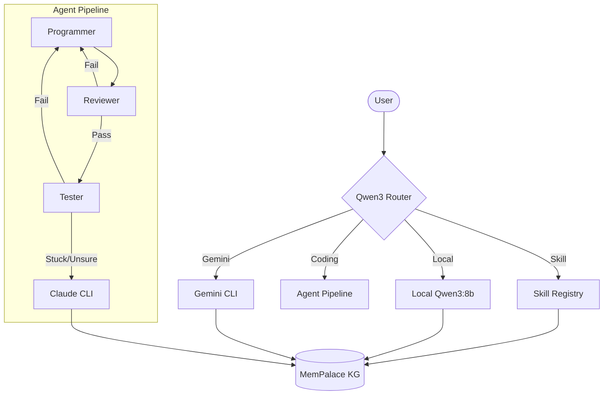

# Cascade

> A local-first AI assistant and coding agent — Qwen3 for speed, Gemini for research, Claude for hard coding.

---

## What It Is

Cascade is a personal AI system built around three models in a smart routing layer:

- **Qwen3:8b** (local via Ollama) — free, private, instant for simple queries
- **Gemini** (Google CLI, OAuth) — research, analysis, news, job briefings, conversation
- **Claude** (Claude Code CLI, Pro sub) — complex coding, architecture, implementation

Every message is automatically routed to the right model. You can override with `!!` (Claude) or `!g` (Gemini).

---

## Architecture

Cascade follows a tiered architecture designed for speed, cost-efficiency, and high-quality results.



### Core Components

- **Routing Layer (`llm.py`)**: Uses a fast Qwen3:8b model (local) to classify user intent. It decides whether to invoke a specific **Skill**, answer using **Gemini**, or escalate to the **Agent Pipeline**.
- **Agent Pipeline (`agent.py`)**: A multi-role system (Programmer, Reviewer, Tester) that iterates on coding tasks. It uses local models for fast iteration but escalates to **Claude** if it gets stuck or the task is highly complex.
- **Skill System (`skills/`)**: Pluggable modules for specific domains like Fintech news, job analysis, or Google Calendar integration.
- **Memory Layer (`mempalace`)**: All interactions are indexed and stored in a shared Knowledge Graph, allowing Cascade to "remember" context across different sessions and interfaces.

---

## Interfaces

### 1. Terminal REPL
Interactive mode with streaming output.
```bash
cascade
```
Supports forcing backends: `!!` for Claude, `!g` for Gemini.

### 2. Agent Pipeline (CLI)
Directly execute complex coding tasks.
```bash
cascade "refactor auth.py to use JWT"
```

### 3. Telegram Bot
A full-featured coordinator for mobile access.
```bash
cascade bot
```
Handles text, voice, documents, and images.

---

## Agent Pipeline Details

The pipeline uses a state machine to move between roles:

| Role | Responsibility | Strategy |
|------|----------------|----------|
| **Programmer** | Implementation | Writes code, creates files, runs bash commands. |
| **Reviewer** | Quality Control | Reads code, checks for logic errors and standards. |
| **Tester** | Verification | Writes and executes tests to confirm functionality. |

If the **Tester** fails repeatedly or the **Reviewer** identifies architectural uncertainty, the task is escalated to **Claude Code CLI** for high-tier reasoning.

### Background watcher (cron)
Monitors jobs and news every 4 hours. Sends Telegram alerts for high-fit jobs and fintech news.

### Daily brief
```bash
cascade brief
```
Morning briefing sent to Telegram — news + job digest.

---

## Skills

| Skill | Backend | What it does |
|-------|---------|-------------|
| `/news` | Gemini | Curated fintech briefing — picks what matters to you, explains why |
| `/jobs` | Gemini | Analyses high-fit jobs — what to apply for, what to highlight, what gaps exist |
| `/email inbox` | Gemini + Claude | Summarises inbox; reads full thread before drafting replies |
| `/email reply <subject>: <intent>` | Claude | Reads full thread context, drafts in your voice |
| `/calendar today/week/free/add` | Claude | Google Calendar read and create |
| `/browse <url or query>` | — | Fetch URL or web search |
| `/match` | Claude | Match resume against cached job listings |
| `/remind <text>` | — | Natural language reminders |
| `/system` | Qwen3 | RAM, disk, Ollama, Gemini, MemPalace, Cascade status |
| `/plan trip <destination>` | Gemini | Visa, areas, itinerary, budget |
| `/plan research <company/topic>` | Gemini | Deep brief with fresh web data |
| `/plan interview <company> [role]` | Gemini | Fit analysis, likely questions, talking points |
| `/plan meeting <person/topic>` | Gemini | Agenda, context, what to push for |
| `/graphify <text>` | — | Save to MemPalace knowledge graph |

---

## Agent Pipeline

Used for coding tasks (`cascade "task"`):

| Role | Tools | Max iterations | Escalates when |
|------|-------|---------------|----------------|
| Programmer | bash, read, write, edit, glob, grep | 8 | Uncertain or stuck |
| Reviewer | read, glob, grep (read-only) | 3 | Uncertain about quality |
| Tester | bash, read, glob | 4 | Tests fail repeatedly |

Tool call formats supported: XML (`<tool>`), function XML (`<function>`), JSON object, markdown bash blocks.

---

## Memory

All exchanges (REPL, Telegram, skills) are saved to MemPalace at `~/.mempalace/palace`.
Sessions from `~/.claude/projects/` are mined into MemPalace on every Claude Code exit.

Both Cascade and Claude Code share the same memory store — context flows between them.

---

## Configuration

**`config.yml`** — model and escalation settings:
```yaml
local_model: qwen3:8b      # swap to qwen3:32b after 64GB RAM upgrade
```

**`~/.cascade.env`** — secrets:
```
TELEGRAM_TOKEN=...
TELEGRAM_CHAT_ID=...
```

**`~/.gemini/settings.json`** — Gemini OAuth (auto-configured on first `gemini` login).

---

## Setup

**Requirements:**
- [Ollama](https://ollama.ai) with `qwen3:8b` pulled
- [Claude Code CLI](https://claude.ai/code) authenticated (Pro subscription)
- [Gemini CLI](https://github.com/google-gemini/gemini-cli) authenticated (Google account)

```bash
# Clone
git clone https://github.com/anilvignesh/cascade
cd cascade
pip install -e .

# Pull local model
ollama pull qwen3:8b

# Authenticate Gemini (one-time)
gemini

# Run
cascade
```

---

## Hardware

Current: AMD Ryzen 5 7530U, 16GB DDR4 3200MHz, 476GB NVMe.

At 16GB, Qwen3:8b runs in ~90s/call and Claude escalation happens often. After upgrading to 64GB RAM, swap to `qwen3:32b` in `config.yml` — response time drops to ~30s and most tasks stay local.

---

## Project Structure

```
cascade/
├── cascade/
│   ├── llm.py            # Three backends: call_local, call_gemini, call_claude
│   ├── repl.py           # Interactive REPL with streaming Qwen3
│   ├── agent.py          # Coding agent loop — Programmer → Reviewer → Tester
│   ├── telegram_bot.py   # Telegram coordinator — text, voice, docs, photos
│   ├── tools.py          # Tool registry (bash, read, write, edit, grep, glob)
│   ├── roles.py          # Role definitions + system prompts
│   ├── skills.py         # Skills loader
│   ├── watcher.py        # Background job + news watcher
│   ├── brief.py          # Daily brief generator
│   └── state.py          # Agent state machine
├── skills/
│   ├── news/             # Gemini-powered fintech briefing
│   ├── jobs/             # Gemini job fit analysis
│   ├── email/            # Claude email agent (full thread context)
│   ├── calendar/         # Google Calendar
│   ├── browse/           # Web fetch + search
│   ├── match/            # Resume-job matching
│   ├── remind/           # Reminders
│   ├── system/           # Laptop health
│   └── graphify/         # MemPalace KG
├── config.yml
├── run.py
└── .agent/
    └── worker-state.json # Live agent state
```

---

## Author

Built by [Anil Vignesh](https://github.com/anilvignesh) — Senior PM in cross-border payments.
